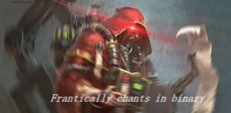

EE graduate who builds systems and AI-driven software by day and relearns physics by night.
The AI handles the boilerplate; the physics, sadly, I still have to do myself.

  <a href="https://rua.systems">rua.systems</a> ·
  <a href="https://resume.ruasystems.com/en">Resume</a> ·
  <a href="mailto:hasan@ruasystems.com">hasan@ruasystems.com</a>

  

